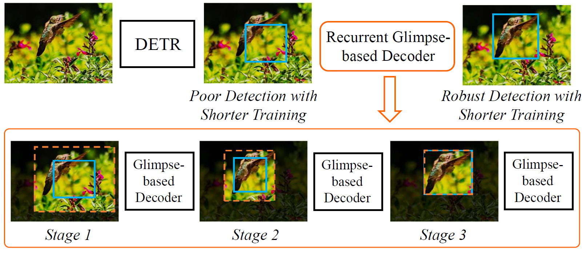

# REGO-Deformable DETR (Accepted as ORAL in CVPR2022)
[](https://paperswithcode.com/sota/object-detection-on-coco-1?p=recurrent-glimpse-based-decoder-for-detection)

By [Zhe Chen](https://scholar.google.cz/citations?user=Jgt6vEAAAAAJ&hl),  [Jing Zhang](https://scholar.google.com/citations?user=9jH5v74AAAAJ&hl), and [Dacheng Tao](https://scholar.google.com/citations?user=RwlJNLcAAAAJ&hl).

This repository is the implementation of the paper [Recurrent Glimpse-based Decoder for Detection with Transformer](https://arxiv.org/abs/2112.04632). 

This code is heavily based on the implementation of [Deformable DETR](https://github.com/fundamentalvision/Deformable-DETR.git).


## Introduction



**Abstract.** Although detection with Transformer (DETR) is increasingly popular, its global attention modeling requires an extremely long training period to optimize and achieve promising detection performance. Alternative to existing studies that mainly develop advanced feature or embedding designs to tackle the training issue, we point out that the Region-of-Interest (RoI) based detection refinement can easily help mitigate the difficulty of training for DETR methods. Based on this, we introduce a novel REcurrent Glimpse-based decOder (REGO) in this paper. In particular, the REGO employs a multi-stage recurrent processing structure to help the attention of DETR gradually focus on foreground objects more accurately. In each processing stage, visual features are extracted as glimpse features from RoIs with enlarged bounding box areas of detection results from the previous stage. Then, a glimpse-based decoder is introduced to provide refined detection results based on both the glimpse features and the attention modeling outputs of the previous stage. In practice, REGO can be easily embedded in representative DETR variants while maintaining their fully end-to-end training and inference pipelines. In particular, REGO helps Deformable DETR achieve 44.8 AP on the MSCOCO dataset with only 36 training epochs, compared with the first DETR and the Deformable DETR that require 500 and 50 epochs to achieve comparable performance, respectively. Experiments also show that REGO consistently boosts the performance of different DETR detectors by up to 7% relative gain at the same setting of 50 training epochs.

## License

This project is released under the [Apache 2.0 license](./LICENSE).


## Citing Deformable DETR
If you find REGO useful in your research, please consider citing:
```bibtex
@inproceedings{chen2022recurrent,
  title={Recurrent glimpse-based decoder for detection with transformer},
  author={Chen, Zhe and Zhang, Jing and Tao, Dacheng},
  booktitle={Proceedings of the IEEE/CVF Conference on Computer Vision and Pattern Recognition},
  pages={5260--5269},
  year={2022}
}
```

## Main Results

| <sub><sub>Method</sub></sub>   | <sub><sub>Epochs</sub></sub> | <sub><sub>AP</sub></sub> | <sub><sub>AP<sub>S</sub></sub></sub> | <sub><sub>AP<sub>M</sub></sub></sub> | <sub><sub>AP<sub>L</sub></sub></sub> | <sub><sub>FLOPs<br>(G)</sub></sub> | <sub><sub>URL</sub></sub>                     |
| ----------------------------------- | :----: | :--: | :----: | :---: | :---------------------: | ----- | ----- |
| <sub><sub>Faster R-CNN + FPN</sub></sub> | <sub>109</sub> | <sub>42.0</sub> | <sub>26.6</sub> | <sub>45.4</sub> | <sub>53.4</sub> |<sub>180</sub> | <sub>-</sub> |
| <sub><sub>Deformable DETR</sub></sub> | <sub>50</sub> | <sub>44.5</sub> | <sub>27.1</sub> | <sub>47.6</sub> | <sub>59.6</sub> | <sub>173</sub> | <sub>[config](./configs/r50_deformable_detr.sh)<br/>[log](https://drive.google.com/file/d/18YSLshFjc_erOLfFC-hHu4MX4iyz1Dqr/view?usp=sharing)</sub>  |
| <sub><sub>Deformable DETR ** </sub></sub> | <sub>50</sub> | <sub>46.2</sub> | <sub>28.3</sub> | <sub>49.2</sub> | <sub>61.5</sub> | <sub>173</sub>| <sub>[config](./configs/r50_deformable_detr_plus_iterative_bbox_refinement.sh)<br/>[log](https://drive.google.com/file/d/1DFNloITi1SFBWjYzvVEAI75ndwmGM1Uj/view?usp=sharing)</sub> |
| **<sub><sub>REGO-Deformable DETR</sub></sub>** | <sub>50</sub> | <sub>46.3</sub> | <sub>28.7</sub> | <sub>49.5</sub> | <sub>60.9</sub> | <sub>190</sub> | <sub>[config](./configs/r50_deformable_detr-rego.sh)<br/>[log](https://www.dropbox.com/s/h0hgu4zw09x2gpk/r50-rego.txt?dl=0) [model](https://www.dropbox.com/s/9z2g1rq0gre0lel/r50-deformable-detr-rego.pth?dl=0)</sub> |
| **<sub><sub>REGO-Deformable DETR ** </sub></sub>** | <sub>50</sub> | <sub>47.9</sub> | <sub>30.3</sub> | <sub>50.9</sub> | <sub>62.1</sub> | <sub>190</sub>|<sub>[config](./configs/r50_deformable_detr_plus_iterative_bbox_refinement-rego.sh)<br/>[log](https://www.dropbox.com/s/r38z9mf6wjwlxfk/r50-plus-plus-rego.txt?dl=0) [model](https://www.dropbox.com/s/487a4aqbn8wfwxw/r50-deformable-detr-plus-plus-rego.pth?dl=0)</sub> |

*Note:*

Update: Sorry that the log files and checkpoints were lost when I finished my post-doctoral position. The data and the original project were stored on the dropbox supported by the previous university, and I forgot to transfer them. In principle, using the code of this project should reproduce the results. 

1. **: Refine with two-stage Deformable DETR and iterative bounding box refinement.

2. I have cleaned up the code. I have re-trained the models and obtained slightly better performance than what the paper reports.

3. There may be fluctuations in performance after training. 


## Installation

Please follow the [Deformable DETR](https://github.com/fundamentalvision/Deformable-DETR).

## Usage
When using REGO, please add '--use_rego' to the training or testing scripts. 

